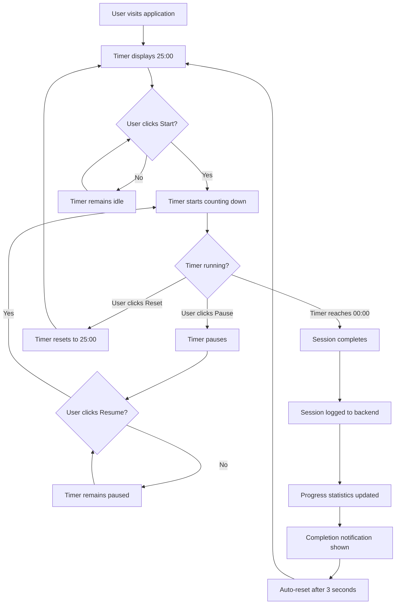
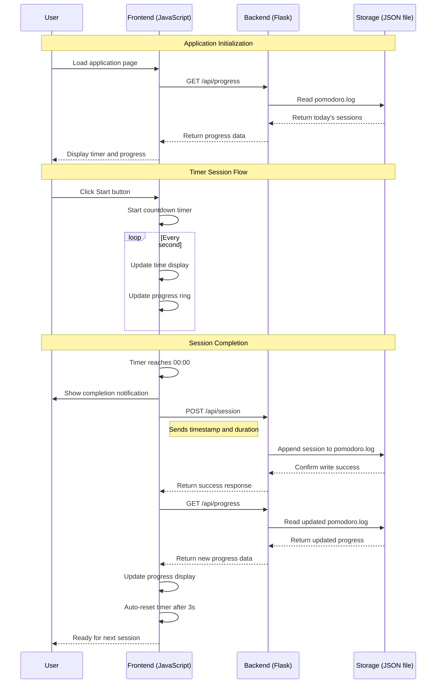

# Pomodoro Timer Application Documentation

## Overview

The Pomodoro Timer is a web-based productivity application that helps users manage their time using the Pomodoro Technique. The application provides a 25-minute focus timer with visual progress tracking and session logging capabilities.

## Architecture

### Technology Stack
- **Backend**: Python Flask web framework
- **Frontend**: HTML5, CSS3, JavaScript (ES6+)
- **Data Storage**: JSON log files
- **UI Components**: SVG-based circular progress indicator

### Application Structure
```
├── app.py              # Flask backend application
├── templates/
│   └── index.html      # Main HTML template with visual effects containers
├── static/
│   ├── style.css       # Application styles with particle/ripple animations
│   └── timer.js        # Frontend JavaScript logic with visual effects system
├── tests/
│   └── test_app.py     # Unit tests
└── pomodoro.log        # Session data storage (created at runtime)
```

## Core Features

### 1. Timer Functionality
- **Duration**: 25-minute (1500 seconds) focus sessions
- **Controls**: Start, Pause, Resume, Reset
- **Visual Progress**: Circular SVG progress ring
- **Auto-completion**: Automatic session logging and reset

### 2. Session Tracking
- **Logging**: Persistent storage of completed sessions
- **Progress Display**: Real-time today's statistics
- **Data Format**: JSON-based session records with timestamp and duration

### 3. User Interface
- **Responsive Design**: Mobile-friendly layout
- **Visual States**: Different colors for idle, running, and completed states
- **Notifications**: Browser notifications for session completion (when permitted)

### 4. Enhanced Visual Feedback
- **Particle Effects**: Floating animated particles during active timer sessions
- **Ripple Animations**: Concentric ripple effects emanating from the center during sessions
- **Dynamic Color Transitions**: Progress ring changes color based on timer state (idle: red, running: teal, completed: green)
- **Smooth Animations**: CSS transitions for button hovers, progress updates, and state changes
- **Background Effects**: Contextual visual effects that activate only during timer sessions

## API Endpoints

### POST `/api/session`
**Purpose**: Log a completed Pomodoro session

**Request Body**:
```json
{
  "timestamp": "2024-01-01T12:00:00",  // Optional, defaults to current time
  "duration": 1500                     // Optional, defaults to 25 minutes
}
```

**Response**:
```json
{
  "success": true,
  "message": "Session logged successfully"
}
```

**Error Response** (400):
```json
{
  "error": "Duration must be at least 30 seconds"
}
```

### GET `/api/progress`
**Purpose**: Retrieve today's progress statistics

**Response**:
```json
{
  "count": 3,      // Number of completed sessions today
  "minutes": 75    // Total focus minutes today
}
```

## User Flow Chart



## Sequence Diagram



## Data Flow

### Session Data Structure
```json
{
  "timestamp": "2024-01-01T12:25:00.000Z",
  "duration": 1500,
  "date": "2024-01-01"
}
```

### Progress Calculation Algorithm
1. Read all entries from `pomodoro.log`
2. Filter sessions by today's date (`date` field)
3. Count total sessions
4. Sum duration of all sessions (convert to minutes)
5. Return aggregated statistics

## Component Interactions

### Frontend Components
- **PomodoroTimer Class**: Main controller managing timer state and visual effects
- **UI Elements**: DOM manipulation for display updates
- **API Client**: Fetch-based communication with backend
- **Progress Ring**: SVG circle with animated stroke-dashoffset and dynamic color changes
- **Particle System**: Dynamic particle generation and animation management
- **Visual Effects Controller**: Manages ripple effects, color transitions, and background animations

### Backend Components
- **Flask App**: HTTP request routing and response handling
- **SessionLogger Class**: File I/O operations for session persistence
- **API Routes**: RESTful endpoints for session and progress management

## Error Handling

### Frontend
- **Network Errors**: Graceful degradation when API calls fail
- **Timer State**: Consistent UI state management during interruptions

### Backend
- **File I/O**: Exception handling for log file operations
- **Input Validation**: Duration and timestamp parameter validation
- **Logging**: Structured logging for debugging and monitoring

## Enhanced Visual Feedback System

### Particle Effects
- **Implementation**: CSS animations with JavaScript-generated DOM elements
- **Behavior**: Particles float upward with random positions and durations (4-8 seconds)
- **Activation**: Only during active timer sessions to minimize distraction
- **Performance**: Automatic cleanup of particles after animation completion

### Ripple Animations
- **Design**: Four concentric ripples with staggered animation delays
- **Effect**: Expanding circles from center with opacity fade-out
- **Duration**: 4-second animation cycle per ripple
- **Styling**: Semi-transparent white borders for subtle visual impact

### Dynamic Color System
- **Idle State**: Red (#ff6b6b) - Default Pomodoro color
- **Running State**: Teal (#4ecdc4) - Active/focused color
- **Completed State**: Green (#26de81) - Success color
- **Transitions**: Smooth CSS transitions (0.5s ease-in-out)

### Performance Optimizations
- **Conditional Rendering**: Effects only activate during timer sessions
- **Memory Management**: Automatic cleanup of particle elements
- **CSS Hardware Acceleration**: Transform-based animations for smooth performance
- **Minimal DOM Impact**: Lightweight particle creation with efficient removal

## Browser Compatibility

### Minimum Requirements
- **JavaScript**: ES6+ support (classes, async/await, fetch API)
- **CSS**: Flexbox, CSS Grid, SVG support, CSS animations and transforms
- **HTML**: HTML5 semantic elements

### Progressive Enhancement
- **Notifications**: Optional browser notification API
- **Visual Effects**: Graceful degradation for older browsers
- **Local Storage**: Could be added for offline session caching
- **Service Worker**: Potential for offline functionality

## Performance Considerations

### Frontend Optimization
- **Timer Updates**: 1-second intervals with minimal DOM manipulation
- **Progress Ring**: CSS transitions for smooth animations
- **Visual Effects**: Conditional activation and automatic cleanup
- **Particle System**: Efficient creation/destruction cycle (200ms intervals)
- **Memory Management**: Proper cleanup of intervals, event listeners, and DOM elements

### Backend Optimization
- **File I/O**: Append-only operations for session logging
- **Data Processing**: Efficient daily progress calculation
- **Caching**: Potential for in-memory progress caching

## Security Considerations

### Input Validation
- **Duration Limits**: Minimum 30-second validation
- **Timestamp Format**: ISO string format validation
- **File Access**: Controlled file operations within application directory

### CORS and CSP
- **Same-Origin**: Frontend and backend served from same domain
- **Content Security**: No external script dependencies
- **Data Sanitization**: JSON parsing with error handling

## Future Enhancement Opportunities

### Feature Extensions
1. **Break Timers**: 5-minute short breaks and 15-minute long breaks
2. **Custom Durations**: User-configurable session lengths
3. **Statistics Dashboard**: Weekly/monthly progress charts
4. **Sound Notifications**: Audio alerts for session completion
5. **Enhanced Themes**: Multiple color schemes, particle styles, and visual themes
6. **Advanced Animations**: Custom particle shapes, seasonal effects, and user-selectable animations
7. **Accessibility Options**: Reduced motion settings and visual effect toggles

### Technical Improvements
1. **Database Storage**: Replace file-based storage with SQLite/PostgreSQL
2. **User Authentication**: Multi-user support with session isolation
3. **Real-time Updates**: WebSocket for live progress updates
4. **Offline Support**: Service worker for offline functionality
5. **Mobile App**: Progressive Web App (PWA) capabilities